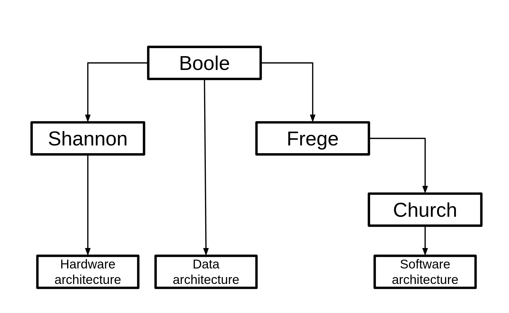

\doublespacing
```{r setup, include=FALSE}
knitr::opts_chunk$set(echo = FALSE)
library(knitr)
```

# Introduction

Stances on the ontology of information vary, as do understandings of whether the information is distinct from data. Yet there is the common claim that we live in the information age (@castells1996information), so raising an apparent paradox. If there is no consistent stance on what is the ontology of information, how can we be living in an age characterized by information?

This thesis will consider the ontology of information from the start of theoretical underpinnings for the modern computer era (@machale2014life,  @nahin2017logician) in the latter part of the 19th century, through to the middle of the 20th century and the work of the early modern logicians. Information will be seen like that on which logic operates, and the ontology of information evolves to meet the needs of the development of logic.

Why this matters is that by the late 1940s, the components of a computer and how it operates was essentially understood (@von1993first, @shannon1949mathematical). Yet abstracted and inherent within this von Neuman architecture, was both the logical systems and the associated stances on information from the previous 100 years of modern analytical logic.

Since the 1950s, the focus of innovation shifted to the development of the silicon-based Central Processor Unit (@eckstein2007jack, @berlin2001robert) and the development of Operating Systems (@cooke1999unix) as well as evolving the software (@kernighan1984unix). Yet the origins remain self-evident and widely acknowledged within computer science.


