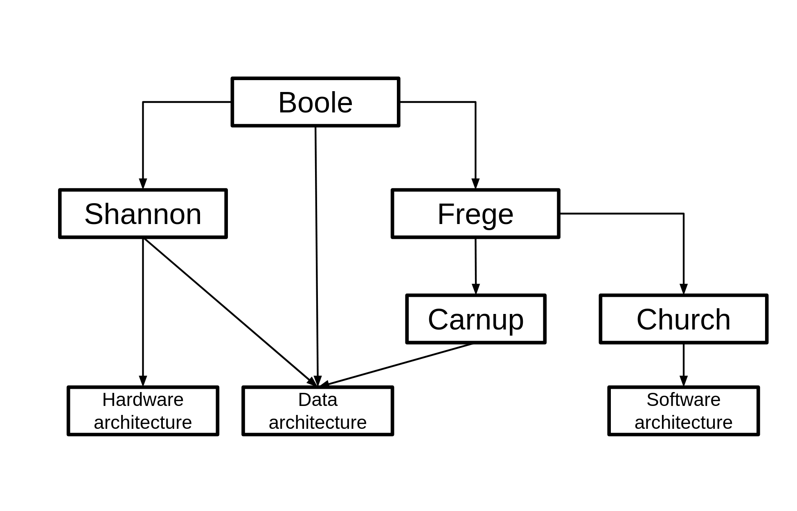

\doublespacing
```{r setup, include=FALSE}
knitr::opts_chunk$set(echo = FALSE)
library(knitr)
```

# Introduction

Stances on the ontology of information vary, as do understandings of whether the information is distinct from data. Yet there is the common claim that we live in the information age (@castells1996information), so raising an apparent paradox. If there is no consistent stance on what is the ontology of information, how can we be living in an age characterized by information?

This thesis will consider the ontology of information from the start of theoretical underpinnings for the modern computer era (@machale2014life,  @nahin2017logician) in the latter part of the 19th century, through to the middle of the 20th century and the work of the early modern logicians. Information will be seen like that on which logic operates, and the ontology of information evolves to meet the needs of the development of logic.

Why this matters is that by the late 1940s, the components of a computer and how it operates was essentially understood (@von1993first, @shannon1949mathematical). Yet abstracted and inherent within this von Neuman architecture, was both the logical systems and the associated stances on information from the previous 100 years of modern analytical logic.

Since the 1950s, the focus of innovation shifted to the development of the silicon-based Central Processor Unit (@eckstein2007jack, @berlin2001robert) and the development of Operating Systems (@cooke1999unix) as well as evolving the software (@kernighan1984unix). Yet the origins remain self-evident and widely acknowledged within computer science.



## Boole
George Boole (1815 - 1816) and his “An investigation of the laws of thought” (@1854investigation) is often regarded as the start of the information age (@nahin2017logician) and sometimes this work is also regarded as the commencement of modern logic (@hughes1968introduction). Boole saw the subject of his book as being on how classical logic underpinned reasoning and the laws of thought. Although later authors have reinterpreted Boole in light of subsequent theoretical developments (@douglas2020set, @brown2012boolean). Throughout the "The laws of thought", Boole overtly saw his study as being very much part of the revivalist movement in the early 19th century and is built on the wildly popular work of ArchBishop Whatley (@whately1826elements).

Boole took an overtly Neoplatonist position on the objects of cognition and the external objects of perception. The former was the true form on which his logic of reasoning would operate.

\begin{quotation}
It has been maintained, that propositions of the class referred to exist in the mind independently of experience, and that those conceptions which are the subjects of them are the imprints of eternal archetypes. With such archetypes, conceived, however, to possess a reality of which all the objects of sense are but a faint shadow or dim suggestion, Plato furnished his ideal world.
\end{quotation}
\flushright (@boole1854investigation, para 22.5)
\flushleft

In contrast, the external objects of perception were imperfect manifestations of this pure form. Their appearance and behaviour were governed by statistics.  For Boole, information was internal cognitive objects and data was the external objects of perception. What Boole would go on to demonstrate was that his calculus applies equally to both such internal and external objects.

If Boole’s ontology of information is Neoplatonist, then his logic is Aristotelian and hence Boole’s logic might be best regarded as the first modern first-order logic. Cognitive objects are grouped together by their attributes and create a primary proposition. So B might be the colour black, W might be woolly and S might be sheep. So BWS, if all present in a single object is a black woolly sheep.  The secondary propositions for cognition as to whether such a cognitive object is present or not in time and space. 

Boole was the originator of two important concepts. The first was his concept that if attribute “X” was absent then “X” was assigned “0” in Boole’s calculus and if “X” was present then it was assigned a value of “1” (@boole1854investigation, para 2.6). So that in a primary proposition, about a cognitive object, the attributes could be present or absent. In a secondary proposition, the attributes were true or false in time or space.

The other concept that Boole was “the Universe of Discourse”, specifically with regards to considerations of time and space (@boole1854investigation, p. 30) and so confining the scope of any analysis.

As will be elaborated later, the above is the basis for the formation rules of Boole’s logic and encapsulates the semantic meaning in a well-formed formula (wff). His calculus then allows the transformation through the manipulation of such wff to allow core insights akin to cognition to be revealed.


# Random equations of no significance
These are just here to prove (to myself) that it is possible to produce both mathematical and logical symbols.

\begin{equation}
(\exists x) (Px \rightarrow Lx)
\end{equation}

\begin{equation}
\Box p \supset \Diamond p
\end{equation}

\begin{equation}
I(s_i) = -log_2(p_i)
\end{equation}

It also raises the question of whether I should be using "$\Box$ and $\Diamond$" or "*L* and *M*" for the modal operators in the thesis?

\newpage